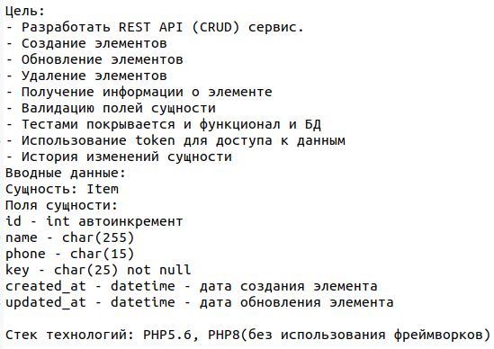

# CRUD api - test task
## What is it?

## Getting, deploy, run
1. git clone 
2. docker-compose up
3. docker exec -it crud-api composer install
4. docker exec -it crud-api composer db:create
## Using
Send requests with postman
## Testing
docker exec -it crud-api composer test
## Code lintering (code sniffing)
docker exec -it crud-api composer code-sniffer
